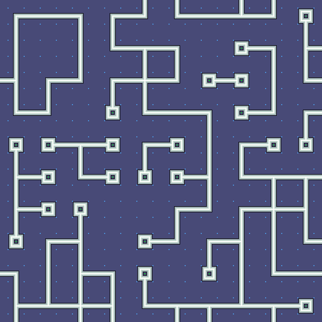
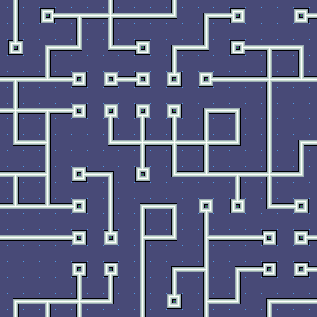
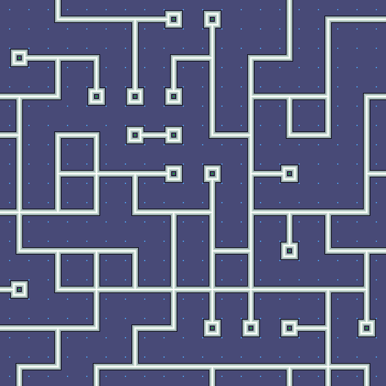

# WaveFunctionCollapse
A very simple and robust wave function collapse library implemented in Lua; intended to be used with [Love2D](https://www.love2d.org/).

# Map Generations
Import the wave function collapse:
```lua
local collapse = require "WaveFunctionCollapse"
```

Construct the set of options, based on Left, Up, Right & Down 'bonds'; here's a simple set of corners plus an empty option:
```lua
local set = { { l = 0, u = 0, r = 0, d = 0 }
            , { l = 1, u = 1, r = 0, d = 0 }
            , { l = 1, u = 0, r = 0, d = 1 }
            , { l = 0, u = 0, r = 1, d = 1 }
            , { l = 0, u = 1, r = 1, d = 0 } }
```
> [!NOTE]
> The values are arbitrary, here we use `0` to mean empty and `1` to mean a connection. Any value can be used and mixed, allowing for complex constructions.

Create a table and define a size for it (E.g. Width and Height as 8):
```lua
local map = { }
local w   =  8
local h   =  8
```

Define a picker function to select one of the possible options when collapsing, this one picks at random:
```lua
function pick(candidates)
    return candidates[random(#candidates)]
end

```
Lastly, collapse:
```lua
local unexhausted = collapse(map, w, h, set, pick)
```
> [!NOTE]
> This will collapse a single, perform as needed based on `unexhausted`.

# Demo


---



---


